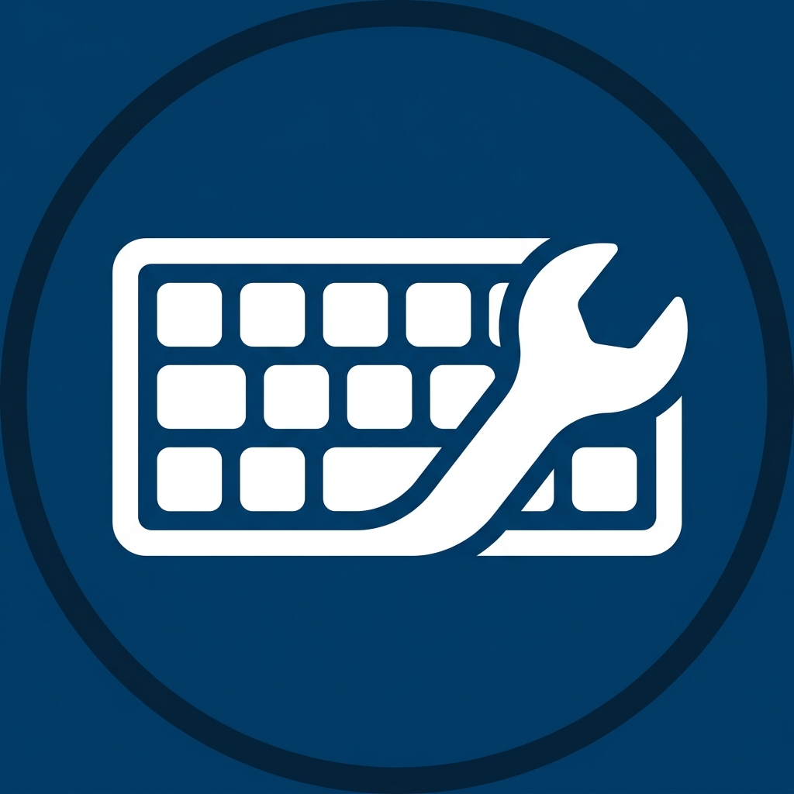

  
  <h1>LayoutFix v1.0.0-beta</h1>
  
<b>The ultimate, zero-configuration auto-switcher for your keyboard layouts.</b>

  

    <a href="#english">English</a> •
    <a href="#русский">Русский</a> •
    <a href="#українська">Українська</a>
  

 

---

## 🇺🇸 English

**LayoutFix** is a smart, native Windows utility that corrects incorrectly typed text when you forget to switch your keyboard layout. Say goodbye to retyping `vfibyf` into `машина` manually.

### Core Features:
- **Zero-Configuration Magic**: Automatically detects installed Windows keyboard layouts. No static JSON dictionaries required!
- **True Multilingual Support**: Built-in Top 20 most popular languages globally, mapping dynamically on-the-fly.
- **Smart Golden Rule**: If what you typed is a valid word in the *current* layout, LayoutFix will *not* auto-convert it, preventing annoying false positives.
- **Short Word Filter**: Safely ignores 1-character typos.
- **Custom Dictionary Exceptions**: Easily whitelist words or acronyms so they are never touched.
- **Native Dark Theme**: The UI dynamically respects your Windows 10/11 Personalization theme.
- **Micro-animations & Sound**: Satisfying typewriter and switch sounds, with clean native performance.

### Installation
1. Go to the [Releases](../../releases) tab.
2. Download `LayoutFix_Setup.exe`.
3. Follow the wizard, and LayoutFix will automatically run in the system tray and start on boot.

---

## 🇷🇺 Русский

**LayoutFix** — это умная и быстрая утилита для Windows, которая автоматически исправляет опечатки, когда вы забыли переключить язык. Забудьте про удаление и перепечатывание `ghbdtn` -> `привет`.

### Основные возможности:
- **Магия без настроек**: Программа автоматически считывает установленные раскладки Windows напрямую из ОС.
- **Поддержка 20 языков**: Встроенные словари для всех популярных европейских языков, динамически подстраиваемые под ваши раскладки.
- **Золотое правило**: Если набранный текст является существующим словом в *текущей* раскладке, программа его не тронет! Забудьте о ложных срабатываниях (например, когда вы специально пишете аббревиатуру).
- **Темная тема**: Интерфейс плавно подстраивается под настройки цвета Windows 10/11.
- **Звуковое сопровождение**: Приятные звуки печатной машинки и переключения языка в стиле оригинального Punto Switcher.
- **Пользовательский словарь**: Добавляйте исключения в один клик.

### Установка
1. Перейдите на вкладку [Releases](../../releases).
2. Скачайте `LayoutFix_Setup.exe`.
3. Установите программу — она сама добавится в автозагрузку и свернется в трей.

---

## 🇺🇦 Українська

**LayoutFix** — це розумна та швидка утиліта для Windows, яка автоматично виправляє помилки, коли ви забули перемикнути мову. Забудьте про видалення та повторне набирання `ghbdtn` -> `привіт`.

### Основні можливості:
- **Магія без налаштувань**: Програма автоматично зчитує встановлені розкладки Windows безпосередньо з ОС.
- **Підтримка 20 мов**: Вбудовані словники для всіх популярних європейських мов, що динамічно адаптуються під ваші розкладки.
- **Золоте правило**: Якщо набраний текст є існуючим словом у *поточній* розкладці, програма його не чіпатиме! Забудьте про хибні спрацьовування.
- **Темна тема**: Інтерфейс автоматично підлаштовується під налаштування кольору Windows 10/11.
- **Користувацький словник**: Додавайте винятки в один клік.

### Встановлення
1. Перейдіть на вкладку [Releases](../../releases).
2. Завантажте `LayoutFix_Setup.exe`.
3. Встановіть програму — вона сама додасться в автозавантаження та згорнеться в трей.

---

  <i>Developed with ❤️ by the Wave-is Open Source Team</i>

