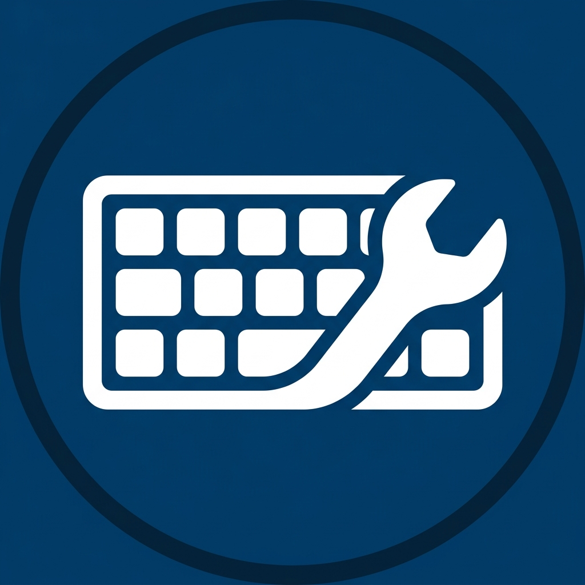

  
  <h1>LayoutFix v1.0.12</h1>
  
<b>A safety-first Windows keyboard-layout fixer and text translator.</b>

  

    <a href="#english">English</a> •
    <a href="#русский">Русский</a> •
    <a href="#українська">Українська</a>
  

   
  <i>v1.0.12 release candidate: manual correction is the primary stable workflow; automatic correction is opt-in.</i>

See [v1.0.12 release notes](RELEASE_NOTES_v1.0.12.md) for the verified scope, upgrade notes, and known limitations. Current verification evidence and the still-open Windows/Adobe release gates are tracked in [READINESS.md](READINESS.md).

 

---

## 🇺🇸 English

# LayoutFix 🛠️

A lightweight, powerful Windows background utility designed to solve common typing annoyances. **LayoutFix** automatically corrects incorrectly typed text when you forget to switch your keyboard layout (say goodbye to retyping `vfibyf` into `машина`!). It also features hotkeys for instant text case conversion and **Offline AI Translation** using local LLMs right inside any window.

### Core Features:
- **Automatic Layout Discovery**: Detects installed Windows keyboard layouts; the order can be changed in Settings.
- **Smart Auto-Correction**: 27 bundled language dictionaries are loaded on demand. If what you typed is a valid word in the *current* layout, LayoutFix will *not* auto-convert it. When RU and UK produce the same visible word, the target layout is selected only with at least a 2× corpus-normalized frequency margin; genuinely shared words remain unchanged. Stable protocol/format/CLI tokens such as `TLS`, `HTTP`, `JSON`, `SSH`, and `npm` remain manual-only even when their wrong-layout spelling collides with a target-language word.
- **Online or Offline Translation**: Translate selected text through the online provider or an optional local Qwen/Qwen2.5 or ALMA model.
  Validated offline targets are EN/RU/FR/ES for Light, EN/RU/UK/FR/ES for Balanced, and EN/RU/UK/DE/FR/ES for ALMA. Guarded offline output preserves standalone numbers, dates, times, percentages, and explicit EN/RU/UK negation. Balanced additionally preserves technical identifiers, nested lists, fenced code, Markdown tables, and link destinations; both senior models prove controlled single-name transliteration, Balanced also passes the multi-identity Olivia/Lucas/Madrid case, and ALMA proves long text and another multi-name identity case. Both senior models pass DE/FR/ES→EN control cases. Targets or combinations that have not passed the quality gate are rejected instead of inserting mixed-language, substituted-name, grammatically known-bad, incomplete, or structurally damaged output; online translation remains available when explicitly enabled.
  The proper-name guard also recognizes conservative `th→т`, `j→дж`, and `x→кс` phonetic equivalents while continuing to reject culturally substituted names; the current Balanced model safely rejects weak Theodore/Jennifer candidates instead of inserting them.
- **Text Manipulation Hotkeys**: Instantly switch the layout of highlighted text, or toggle its case (UPPERCASE, lowercase, Title Case) with a hotkey.
- **Two-level App Exceptions**: Globally disable every LayoutFix action in selected processes, or disable only automatic correction while keeping manual hotkeys available. The automatic-only list can restore the built-in IDE, terminal, remote-desktop, and Adobe safety defaults with one click.
- **Custom Dictionary and Replacements**: Keep abbreviations unchanged and define explicit `typed → replacement` pairs.
- **Native UI**: Dark/Light theme support with fully localized core Settings flows in English, Russian, and Ukrainian.

### Safety and privacy

- Automatic correction is disabled by default. When enabled, it remains disabled by default in code editors/IDEs (including Antigravity, VS Code derivatives, Cursor/Windsurf, and JetBrains products), terminals/shells, remote-desktop clients, and known-problematic Adobe processes; manual hotkeys remain available.
- Keyboard-hook callbacks only enqueue work; clipboard, dictionary, network, and model operations run outside the hook.
- The optional local model runs in a separate worker process; cancellation, timeout, or a native model crash cannot take down the keyboard-hook process.
- Before replacing text, LayoutFix re-checks the exact window, focused control, and selected text.
- Online translation is disabled by default and uses the official, billable [Google Cloud Translation Basic v2 API](https://cloud.google.com/translate/docs/reference/rest/v2/translate). It requires the user's own API key, which is kept in Windows Credential Manager rather than `settings.json`; history and diagnostic logging are also disabled by default. When logging is enabled, exception payloads and absolute Windows paths are redacted, and registered clipboard format names are never recorded.
- The About page can generate a readable compatibility report for support. It contains runtime metadata and configuration counts, never typed text, clipboard data, paths, API keys, process names, custom replacements, or log contents.
- Ordinary Chromium text provenance metadata is restored byte-for-byte. If the clipboard contains a complex bitmap/OLE/application-specific payload that cannot be preserved safely, LayoutFix cancels the text operation without changing it.
- Windows blocks input injection into elevated applications from a normal process; run both applications at the same integrity level.

### Installation
1. Go to the [Releases](../../releases) tab.
2. Download `LayoutFix_Setup.exe`.
3. Verify the adjacent `LayoutFix_Setup.exe.sha256` checksum, then install the app. It will silently run in your system tray.

> **Release-candidate notice:** the v1.0.12 installer is not Authenticode-signed yet, so Windows SmartScreen may show an unknown-publisher warning. Install it only after verifying the checksum. Automatic correction remains disabled by default.

---

## 🇷🇺 Русский

# LayoutFix 🛠️

**LayoutFix** — это умная и быстрая утилита для Windows, которая автоматически исправляет опечатки, когда вы забыли переключить язык (например, `ghbdtn` -> `привет`). Кроме того, программа умеет переводить выделенный текст с помощью **локальных нейросетей без интернета** и менять регистр текста по нажатию одной кнопки!

### Основные возможности:
- **Автоматическое определение раскладок**: Программа считывает установленные раскладки Windows; их порядок можно изменить в настройках.
- **Золотое правило**: 27 языковых словарей загружаются по требованию. Если набранный текст является существующим словом в *текущей* раскладке, программа его не тронет. Если RU и UK дают одинаковое видимое слово, целевая раскладка выбирается только при нормализованном частотном перевесе не менее 2×; действительно общие слова остаются без изменений. Устойчивые названия протоколов, форматов и CLI (`TLS`, `HTTP`, `JSON`, `SSH`, `npm`) остаются доступными для ручной смены раскладки, но автоматически не исправляются при случайном совпадении со словом другого языка.
- **Онлайн- и офлайн-перевод**: Выделите текст и нажмите хоткей. Можно использовать сетевой перевод или скачать локальную модель Qwen/Qwen2.5 либо ALMA; безопасный режим локальной модели по умолчанию работает на CPU.
  Проверенные офлайн-языки назначения: EN/RU/FR/ES для Light, EN/RU/UK/FR/ES для Balanced и EN/RU/UK/DE/FR/ES для ALMA. Guard офлайн-результата точно сохраняет отдельные числа, даты, время, проценты и явное EN/RU/UK-отрицание. Balanced дополнительно сохраняет технические идентификаторы, вложенные списки, fenced code, Markdown-таблицы и адреса ссылок; обе старшие модели подтверждены для контролируемой транслитерации одиночного имени, Balanced также проходит multi-identity кейс Olivia/Lucas/Madrid, а ALMA — длинные тексты и другой кейс с несколькими именами. Обе старшие модели проходят DE/FR/ES→EN. Непроверенные или слабые сочетания отклоняются, а не вставляют смешанный, подменяющий имя, грамматически известный как ошибочный, неполный или структурно повреждённый результат; при явном включении остаётся доступен онлайн-перевод.
  Guard имён также распознаёт консервативные фонетические соответствия `th→т`, `j→дж` и `x→кс`, продолжая отклонять культурную подмену имени; слабые реальные варианты Theodore/Jennifer текущая Balanced-модель безопасно отклоняет, а не вставляет.
- **Хоткеи для текста**: Выделите абракадабру и смените ее раскладку одним нажатием. Или поменяйте регистр (ЗАГЛАВНЫЕ, строчные).
- **Два уровня исключений программ**: Можно полностью отключить LayoutFix в выбранных процессах либо запретить только автоисправление, сохранив ручные хоткеи. Встроенный безопасный набор для IDE, терминалов, удалённого рабочего стола и Adobe восстанавливается одной кнопкой.
- **Словарь и свои автозамены**: Добавляйте слова-исключения и пары `что введено → на что заменить`.
- **Нативный интерфейс**: Красивая темная и светлая тема под стиль Windows 11.

### Безопасность и приватность

- Автоисправление по умолчанию выключено. После включения оно всё равно по умолчанию не работает в редакторах кода/IDE (включая Antigravity, варианты VS Code, Cursor/Windsurf и продукты JetBrains), терминалах/shell, клиентах удалённого рабочего стола и известных проблемных процессах Adobe; ручные хоткеи остаются доступными.
- Keyboard hook только ставит действие в очередь: clipboard, словари, сеть и модель не выполняются внутри callback.
- Локальная модель запускается в отдельном worker-процессе: отмена, таймаут или сбой нативной модели не останавливают горячие клавиши.
- Перед заменой повторно проверяются исходное окно, контрол и точный выделенный текст.
- Онлайн-перевод по умолчанию выключен и использует официальный платный [Google Cloud Translation Basic v2 API](https://cloud.google.com/translate/docs/reference/rest/v2/translate). Нужен собственный API-ключ пользователя; он хранится в Диспетчере учётных данных Windows, а не в `settings.json`. История и диагностические логи также выключены; при включении из них удаляются payload исключений и абсолютные Windows-пути, а зарегистрированные имена форматов буфера никогда не записываются.
- На вкладке «О программе» формируется читаемый отчёт для диагностики совместимости. В нём есть только сведения о среде и счётчики настроек — без введённого текста, буфера обмена, путей, API-ключей, имён процессов, своих автозамен и содержимого логов.
- Служебные метаданные обычного текста Chromium восстанавливаются побайтно. Если в clipboard находится сложное изображение/OLE/application-specific содержимое, которое нельзя гарантированно сохранить, операция безопасно отменяется без изменения текста.
- Windows запрещает обычному процессу ввод в приложение, запущенное от администратора; уровни прав должны совпадать.

### Установка
1. Перейдите на вкладку [Releases](../../releases).
2. Скачайте `LayoutFix_Setup.exe`.
3. Сверьте контрольную сумму с файлом `LayoutFix_Setup.exe.sha256`, затем установите программу — она свернется в системный трей и будет работать в фоне.

> **Статус release candidate:** установщик v1.0.12 пока не подписан Authenticode, поэтому Windows SmartScreen может показать предупреждение о неизвестном издателе. Устанавливайте его только после проверки контрольной суммы. Автоисправление по умолчанию выключено.

---

## 🇺🇦 Українська

# LayoutFix 🛠️

**LayoutFix** — це розумна та потужна утиліта для Windows, яка автоматично виправляє помилки, коли ви забули перемикнути мову (наприклад, `ghbdtn` -> `привіт`). Програма також вміє перекладати виділений текст за допомогою **локальних нейромереж без інтернету** та змінювати регістр тексту гарячими клавішами!

### Основні можливості:
- **Автоматичне визначення розкладок**: Програма зчитує встановлені розкладки Windows; їх порядок можна змінити в налаштуваннях.
- **Золоте правило**: 27 мовних словників завантажуються за потреби. Якщо набраний текст є існуючим словом у *поточній* розкладці, програма його не чіпатиме. Коли RU та UK дають однакове видиме слово, цільова розкладка обирається лише за нормалізованої частотної переваги щонайменше 2×; справді спільні слова залишаються без змін. Сталі назви протоколів, форматів і CLI (`TLS`, `HTTP`, `JSON`, `SSH`, `npm`) можна виправити вручну, але вони не змінюються автоматично за випадкового збігу зі словом іншої мови.
- **Онлайн- та офлайн-переклад**: Виділіть текст і натисніть хоткей. Можна використовувати мережевий переклад або локальні моделі Qwen/Qwen2.5 чи ALMA.
  Перевірені офлайн-мови призначення: EN/RU/FR/ES для Light, EN/RU/UK/FR/ES для Balanced і EN/RU/UK/DE/FR/ES для ALMA. Guard офлайн-результату точно зберігає окремі числа, дати, час, відсотки та явне EN/RU/UK-заперечення. Balanced додатково зберігає технічні ідентифікатори, вкладені списки, fenced code, Markdown-таблиці та адреси посилань; обидві старші моделі підтверджені для контрольованої транслітерації одного імені, Balanced також проходить multi-identity кейс Olivia/Lucas/Madrid, а ALMA — довгі тексти й інший кейс із кількома іменами. Обидві старші моделі проходять DE/FR/ES→EN. Неперевірені або слабкі комбінації відхиляються, а не вставляють змішаний, такий, що підміняє ім'я, граматично відомий як помилковий, неповний чи структурно пошкоджений результат; за явного ввімкнення залишається доступним онлайн-переклад.
  Guard імен також розпізнає консервативні фонетичні відповідності `th→т`, `j→дж` і `x→кс`, водночас відхиляючи культурну підміну імені; слабкі реальні варіанти Theodore/Jennifer поточна Balanced-модель безпечно відхиляє, а не вставляє.
- **Гарячі клавіші для тексту**: Виділіть текст і змініть його розкладку або регістр (ВЕЛИКІ, малі літери) в один клік.
- **Два рівні винятків програм**: Можна повністю вимкнути LayoutFix у вибраних процесах або заборонити лише автовиправлення, зберігши ручні гарячі клавіші. Вбудований безпечний набір для IDE, терміналів, віддаленого робочого столу й Adobe відновлюється однією кнопкою.
- **Словник і власні автозаміни**: Додавайте слова-винятки та пари `введений текст → заміна`.
- **Сучасний дизайн**: Красива темна та світла тема в стилі Windows 11.

### Безпека та приватність

- Автовиправлення вимкнене за замовчуванням. Після ввімкнення воно й надалі типово не працює в редакторах коду/IDE (зокрема Antigravity, варіантах VS Code, Cursor/Windsurf і продуктах JetBrains), терміналах/shell, клієнтах віддаленого робочого столу та відомих проблемних процесах Adobe; ручні гарячі клавіші залишаються доступними.
- Перед заміною повторно перевіряються початкове вікно, контрол і точний виділений текст.
- Локальна модель запускається в окремому worker-процесі: скасування, таймаут або збій моделі не зупиняють гарячі клавіші.
- Онлайн-переклад за замовчуванням вимкнений і використовує офіційний платний [Google Cloud Translation Basic v2 API](https://cloud.google.com/translate/docs/reference/rest/v2/translate). Потрібен власний API-ключ користувача; він зберігається у Диспетчері облікових даних Windows, а не в `settings.json`. Історія та діагностичні логи також вимкнені; після ввімкнення з них вилучаються payload винятків і абсолютні Windows-шляхи, а зареєстровані назви форматів буфера ніколи не записуються.
- На вкладці «Про програму» формується читабельний звіт для діагностики сумісності. Він містить лише відомості про середовище та лічильники налаштувань — без введеного тексту, буфера обміну, шляхів, API-ключів, назв процесів, власних автозамін і вмісту журналів.
- Службові метадані звичайного тексту Chromium відновлюються побайтно. Якщо clipboard містить складне зображення/OLE/application-specific наповнення, яке неможливо гарантовано зберегти, операція скасовується без зміни тексту.

### Встановлення
1. Перейдіть на вкладку [Releases](../../releases).
2. Завантажте `LayoutFix_Setup.exe`.
3. Звірте контрольну суму з файлом `LayoutFix_Setup.exe.sha256`, потім установіть програму — вона згорнеться в системний трей.

> **Статус release candidate:** інсталятор v1.0.12 ще не підписаний Authenticode, тому Windows SmartScreen може показати попередження про невідомого видавця. Встановлюйте його лише після перевірки контрольної суми. Автовиправлення типово вимкнене.

---

  <i>Developed with ❤️ by the Wave-is Open Source Team</i> 

